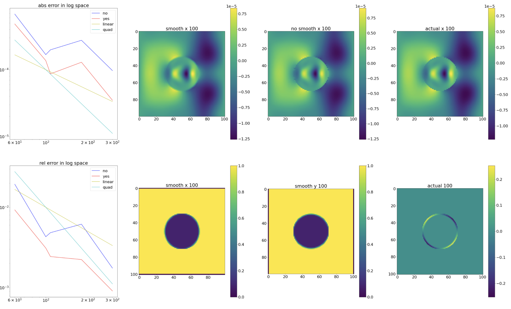
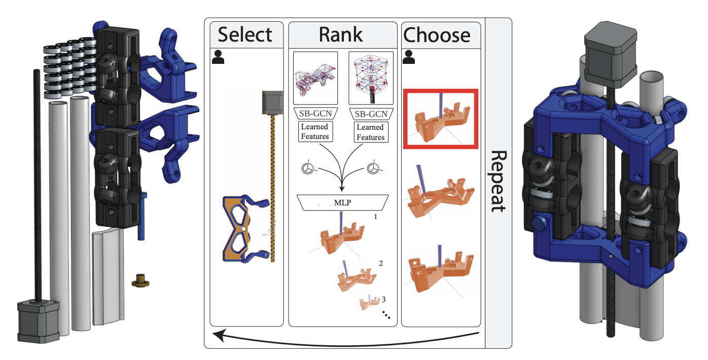
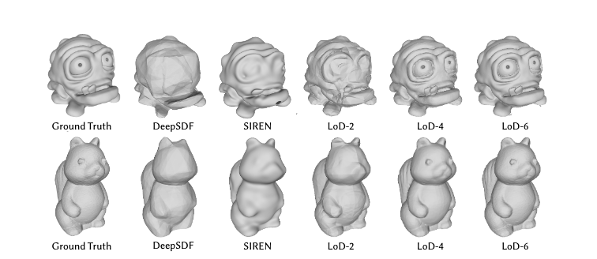
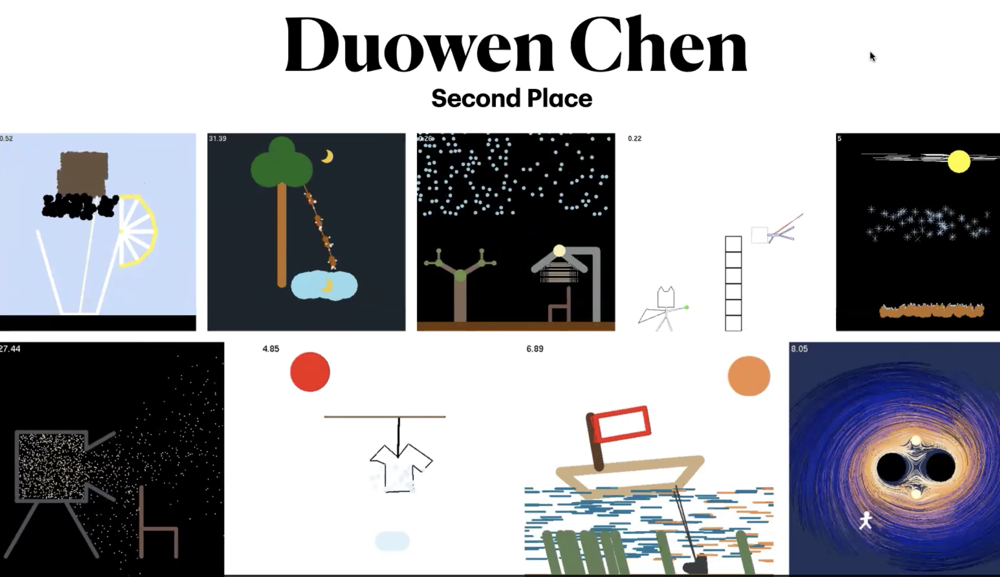
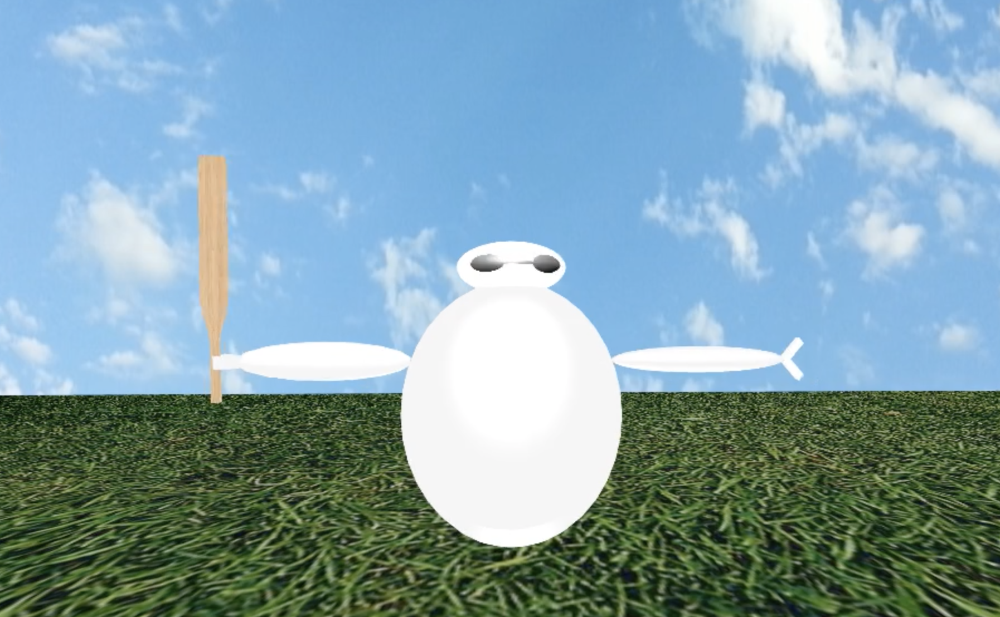

I'm currently a Master student at Columbia University studying Computer Science. Currently, I'm luckily working with Prof. [Changxi Zheng](http://www.cs.columbia.edu/~cxz/) and [Ziwei Zhu](https://2iw31zhv.github.io/). Before this, I was an undergrad at Paul G. Allen School at University of Washington majoring in CS. At that time, I was fortunate to work with Prof. [Adriana Schulz](https://homes.cs.washington.edu/~adriana/) and [Ben Jones](https://homes.cs.washington.edu/~benjones/) at GRAIL.

I'm generally interested in computer graphics, including physicallly-based simulation, and CAD modeling. I'm also interested in rendering and other topics and willing to learn more about these. I also want to explore more on combining data-driven method with computer graphics. 
Here is my [CV](./files/cv.pdf).
## Research

  

    

      

        
      

      

        <b>Data-driven Method for Improving Accuracy of FDTD Simulation with Irregular Geometry </b> 
        Duowen Chen, Ziwei Zhu, Changxi Zheng 
        <a nonsmooth="1" href="None" class="">report (coming soon)</a>
      

    

    

      

        
      

      

        <b>BREP Dataset and GCN for Automatic Mating of CAD Assemblies (2021)</b> 
        <i>Siggraph Asia</i> 
        Benjamin Jones, Dalton Hildreth, <b>Duowen Chen</b>, Ilya Baran, Vova Kim, Adriana Schulz 
        <a nonsmooth="1" href="https://arxiv.org/pdf/2105.12238.pdf" class="">Paper</a>
      

    

  

## Projects & Artworks

  

    

      

        
      

      

        <b>Survey on neural implicit method for reconstruction tasks (2021 Autumn)</b> 
        <i>Columbia University With Honglin Chen</i> 
        <a nonsmooth="1" href="./files/NNDL_Project_Final_Report.pdf" class="">Paper</a>
        <a nonsmooth="1" href="./files/neural-implicit-master.zip" class="">Code</a>
      

    

    

      

        
      

      

        <b>Animation Artworks (2020 Autumn)</b> 
        <i>Columbia University</i> 
        Physics based simulation starting from mass-spring system with different stepping
method to object collisions to rigid body simulations to deformable material simulation  
        <a nonsmooth="1" href="https://youtube.com/playlist?list=PLhhmIdpT64hxKqHGQ7K2xsOvjJvvOXw7T" class="">video</a>
      

    

    

      

        
      

      

        <b>Graphics Artworks (2019 Spring)</b> 
        <i>University of Washington with Zhe Han</i> 
        Synthesized all the topics learned during the class including shading, geometry, ray-tracing
rendering using monte-carlo’s method and animation using splines  
        <a nonsmooth="1" href="https://courses.cs.washington.edu/courses/cse457/19sp/projects/animator/artifacts/8/animation.mp4" class="">video</a>
      

    

  

