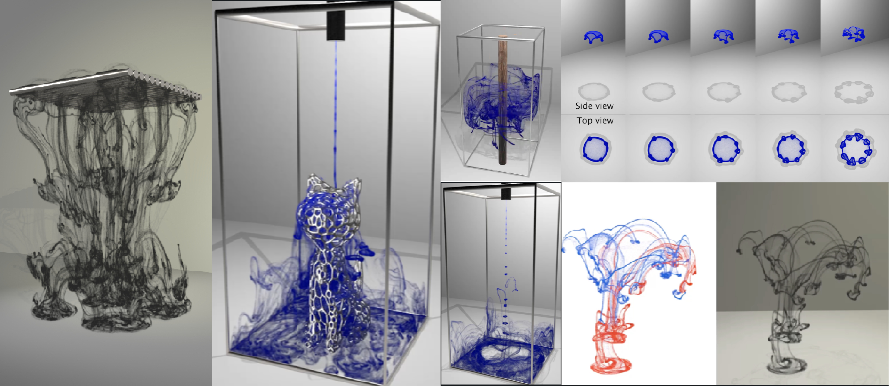
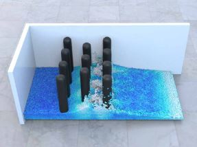

I'm currently a PhD student at Georgia Tech studying Computer Science. Currently, I'm luckily advised by Prof. [Bo Zhu](https://faculty.cc.gatech.edu/~bozhu/). Previsouly, I was fortune to working with Prof. [Changxi Zheng](http://www.cs.columbia.edu/~cxz/) and [Ziwei Zhu](https://2iw31zhv.github.io/) at Columbia University during my Master's Degree and Prof. [Adriana Schulz](https://homes.cs.washington.edu/~adriana/) and [Ben Jones](https://homes.cs.washington.edu/~benjones/) at GRAIL during my undergrad at Paul G. Allen School at University of Washington.
Here is my [CV](../files/duowenchen_cv_2025.pdf).
## Research

  

    

      

        
      

      

        <b>A Neural Particle Level Set Method for Dynamic Interface Tracking</b> 
        <i>ACM Transactions on Graphics (To be presented at Siggraph 2025)</i> 
        <b>Duowen Chen</b>, Junwei Zhou, Bo Zhu 
        <a nonsmooth="1" href="../projects/neural-pls-project-page/static/pdfs/neural-pls.pdf" class="">Paper</a>
        <a nonsmooth="1" href="../projects/neural-pls-project-page/index.html" class="">Project Page</a>
      

    

     
    

      

        
      

      

        <b>Solid-Fluid Interaction on Particle Flow Maps</b> 
        <i>ACM Transactions on Graphics (SIGGRAPH ASIA 2024)</i> 
        <b>Duowen Chen</b>, Zhiqi Li, Junwei Zhou, Fan Feng, Tao Du, Bo Zhu 
        <a nonsmooth="1" href="../projects/pfm-sfi-project-page/static/pdfs/SASIA_2024__Solid_Fluid_Interaction_on_Particle_Flow_Maps.pdf" class="">Paper</a>
        <a nonsmooth="1" href="../projects/pfm-sfi-project-page/index.html" class="">Project Page</a>
      

    

     
    

      

        
      

      

        <b>Particle Laden Fluid on Flow Maps</b> 
        <i>ACM Transactions on Graphics (SIGGRAPH ASIA 2024)</i> 
        Zhiqi Li, <b>Duowen Chen</b>, Candong Lin, Jinyuan Liu, Bo Zhu 
        <a nonsmooth="1" href="https://arxiv.org/pdf/2409.06246" class="">Paper</a>
        <a nonsmooth="1" href="https://pearseven.github.io/LadenFlowProject/" class="">Project Page</a>
      

    

     
    

      

        
      

      

        <b>An Eulerian Vortex Method on Flow Maps</b> 
        <i>ACM Transactions on Graphics (SIGGRAPH ASIA 2024)</i> 
        Sinan Wang, Yitong Deng, Molin Deng, Hong-Xing Yu, Junwei Zhou, <b>Duowen Chen</b>, Taku Komura, Jiajun Wu, Bo Zhu 
        <a nonsmooth="1" href="https://dl.acm.org/doi/pdf/10.1145/3687996" class="">Paper</a>
        <a nonsmooth="1" href="https://evm.sinanw.com/" class="">Project Page</a>
      

    

     
    

      

        
      

      

        <b>Lagrangian Covector Fluid with Free Surface</b> 
        <i>ACM SIGGRAPH 2024 (Conference Track)</i> 
        Zhiqi Li, Barnabás Börcsök, <b>Duowen Chen</b>, Yutong Sun, Bo Zhu, Greg Turk 
        <a nonsmooth="1" href="https://arxiv.org/pdf/2405.09801" class="">Paper</a>
        <a nonsmooth="1" href="https://zhiqili-cg.github.io/CovectorFluidFreeSurface/" class="">Project Page</a>
      

    

     
    

      

        
      

      

        <b>Eulerian-Lagrangian Fluid Simulation on Particle Flow Maps</b> 
        <i>ACM Transactions on Graphics (SIGGRAPH 2024)</i> 
        Junwei Zhou, <b>Duowen Chen</b>, Molin Deng, Yitong Deng, Yuchen Sun, Sinan Wang, Shiying Xiong, Bo Zhu 
        <a nonsmooth="1" href="https://www.arxiv.org/pdf/2405.09672" class="">Paper</a>
        <a nonsmooth="1" href="https://zjw49246.github.io/projects/pfm/" class="">Project Page</a>
      

    

     
    

      

        
      

      

        <b>BREP Dataset and GCN for Automatic Mating of CAD Assemblies</b> 
        <i>ACM Transactions on Graphics (SIGGRAPH ASIA 2021)</i> 
        Benjamin Jones, Dalton Hildreth, <b>Duowen Chen</b>, Ilya Baran, Vova Kim, Adriana Schulz 
        <a nonsmooth="1" href="https://arxiv.org/pdf/2105.12238.pdf" class="">Paper</a>
        <a nonsmooth="1" href="https://grail.cs.washington.edu/projects/automate/" class="">Project Page</a>
      

    

  

## Projects & Artworks

  

    

      

        
      

      

        <b>Data-driven Method for Improving Accuracy of FDTD Simulation with Irregular Geometry </b> 
        Duowen Chen, Ziwei Zhu, Changxi Zheng 
         
        <!-- <a nonsmooth="1" href="None" class="">\n</a> -->        
      

    

    

      

        
      

      

        <b>DesnowNet survey and CycleSnowGAN</b> 
        <i>Personal Project</i> 
        <a nonsmooth="1" href="./files/CycleSNOW.pdf" class="">Paper</a>
        <a nonsmooth="1" href="https://drive.google.com/file/d/1RThID3qo9kXwZ0XjRHKJ240YMcTGfBIc/view?usp=sharing" class="">Code</a>
      

    

    

      

        
      

      

        <b>Survey on neural implicit method for reconstruction tasks (2021 Autumn)</b> 
        <i>Columbia University With Honglin Chen</i> 
        <a nonsmooth="1" href="./files/NNDL_Project_Final_Report.pdf" class="">Paper</a>
        <a nonsmooth="1" href="./files/neural-implicit-master.zip" class="">Code</a>
      

    

    

      

        
      

      

        <b>Animation Artworks (2020 Autumn)</b> 
        <i>Columbia University</i> 
        Physics based simulation starting from mass-spring system with different stepping
method to object collisions to rigid body simulations to deformable material simulation  
        <a nonsmooth="1" href="https://youtube.com/playlist?list=PLhhmIdpT64hxKqHGQ7K2xsOvjJvvOXw7T" class="">video</a>
      

    

    

      

        
      

      

        <b>Graphics Artworks (2019 Spring)</b> 
        <i>University of Washington with Zhe Han</i> 
        Synthesized all the topics learned during the class including shading, geometry, ray-tracing
rendering using monte-carlo’s method and animation using splines  
        <a nonsmooth="1" href="https://courses.cs.washington.edu/courses/cse457/19sp/projects/animator/artifacts/8/animation.mp4" class="">video</a>
      

    

  

